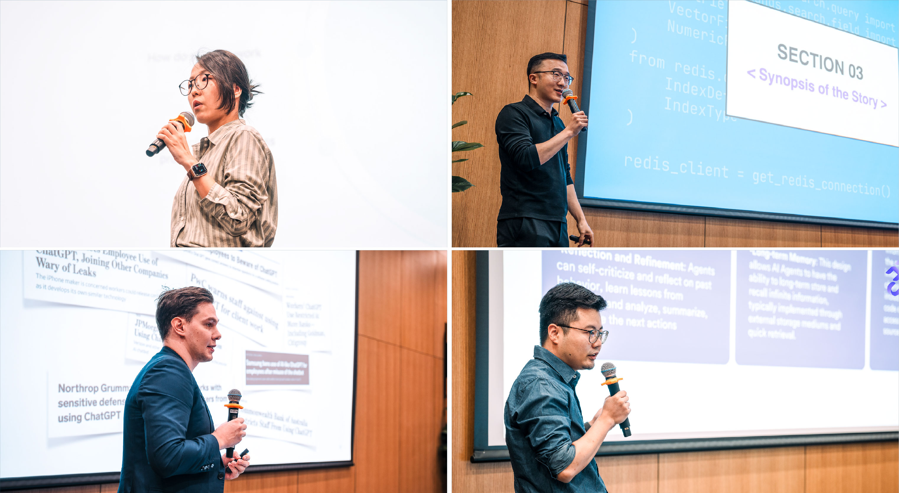

# Students Showcase Creativity and Business Acumen in Digital Innovation Challenge

Nov 16 2023

NYU Shanghai kicked off its second Digital Innovation Challenge (DIC) on
October 28, with around 80 teams from eight universities using generative AI
to solve real-world business problems through innovative solutions. More than
300 students competing represented neighboring Duke Kunshan University, East
China Normal University, Fudan University, Shanghai Jiao Tong University,
Shanghai University of Finance and Economics, ShanghaiTech University, Tongji
University as well as NYU Shanghai.

This year’s theme of “Generative AI Unlocking Business Innovation (with a
focus on Large Language Models)” encouraged cross-disciplinary teams and
students from all majors to develop their own business plans related to
generative AI. The event was sponsored by Shanghai Frontiers Science Center of
Artificial Intelligence and Deep Learning, Computer Science, Data Science, and
Engineering (CSDSE) and [Center for Business Education and
Research](https://cber.shanghai.nyu.edu/) (CBER) at NYU Shanghai.

During the three-week tech-based business competition, each team had the
chance to formally present their projects to the judges and audience. On
Innovation Day, November 18, the top 10 student works will be judged by a
panel of industry guests and entrepreneurs. The audience will vote online to
decide the Best Popularity Award.

Following a keynote speech given by Amazon Web Services Shanghai AI Lab
Director Zhang Zheng, an awards ceremony will be held with awards presented by
NYU Shanghai’s Vice Chancellor [Jeffrey
Lehman](https://shanghai.nyu.edu/academics/faculty/directory/jeffrey-lehman)
and Computer Science, Data Science, and Engineering (CSDSE) Interim Dean
[Nasir Memon](https://shanghai.nyu.edu/academics/faculty/directory/nasir-
memon).

Memon, who as an assistant professor founded [Cybersecurity Games &
Conference](https://www.csaw.io/) (CSAW) and has watched it grow into the
world’s most comprehensive student-run cybersecurity event, said NYU
Shanghai’s competition has a huge potential to grow over the years.

Memon said activities like these give students a vital opportunity to hone
their organizational and interpersonal skills. “AI is transforming the world
today, and lots of innovation will happen. We can participate in and
facilitate that innovation,” he said. “Our students will get inspired when
they see innovative ideas from others around the city, even around the
country.”

During the competition, all contestants received guidance from Interactive
Media Business (IMB), Data Science, and Computer Science faculty as well as
industry professionals.  

Among them, IMB Assistant Professor of Practice [Nicole
Wang](https://shanghai.nyu.edu/academics/faculty/directory/nicole-wang), IMB
Associate Professor of Practice [Gabrielle
Chou](https://shanghai.nyu.edu/academics/faculty/directory/gabrielle-chou),
and Computer Science Professor of Practice [Yik-Cheung (Wilson)
Tam](https://shanghai.nyu.edu/academics/faculty/directory/yik-cheung-wilson-
tam) provided workshops for students over the three weeks. Dr. Chen Meng, AI
director of Chinese e-commerce giant JD.COM, shared his latest research on
dialogue pre-training and practical experiences with industrial-grade dialogue
systems.

  
_Left: Nicole Wang hosting a workshop on “Why AI? How to use it as a tool? ”_  
 _Right: Gabrielle Chou at her workshop on “Crafting a Winning Job-to-Be-Done
and Value Proposition for the DIC Business LLM Competition.”_

Guest speakers such as Brinc’s Strategy & Corporate Innovation Manager Ann
Shen, Ford’s Mach-E former Design Lead Xia Lei, LongAI Co-Founder and CEO
Lukas Tatge, and L’Oréal PPD China’s former Chief Digital Officer (CDO) Liu
Yuchen also shared their insights with students.

  
_Clockwise from top left: Industry guest speakers Ann Shen, Xia Lei, Lukas
Tatge, and Liu Yuchen._

At the Challenge’s kickoff, Provost [Joanna Waley-
Cohen](https://shanghai.nyu.edu/academics/faculty/directory/joanna-waley-
cohen) spoke about the importance of activities like the DIC for cultivating
the essential qualities for innovative education, including algorithmic
thinking, critical analysis, creativity, social perceptiveness,
cosmopolitanism, and the ability to persuade someone to change their mind.
“These are of tremendous relevance to the digital innovation challenge,” she
said.

  
_Joanna Waley-Cohen giving an opening speech at the kick-off ceremony._

Rin Wu Ruilin ’26, President of NYUSHDIC, said the competition is run similar
to a startup. “In the future, we hope DIC can have a wider influence,
gathering more creative minds and spreading innovation beyond the New Bund
Campus,” she said. “DIC will help students turn their imaginations into
reality on a wider scale.”

  
_From left: NYUSHDIC members Jasmin Cai Yejia ’27, Eric Zhao Zifan ’26, and
Rin Wu Ruilin  ’26 in the auditorium on the kick-off day._

NYUSHDIC’s Vice President Tina Song Yuting ’26 said she was proud of
successfully organizing the competition, and highlighted the teamwork needed
to pull it off. “The opportunity for us to experience it from the beginning to
the end is priceless.”

This was NYU Shanghai’s second Digital Innovation Challenge and the first to
be held on the New Bund Campus. The [first such
competition](https://shanghai.nyu.edu/news/student-led-digital-innovation-
challenge-comes-nyu-shanghai) was held in 2021, under the direction of Elena
Huang Yuying ’23 who created the concept.

  
_Left: DIC board shown in the courtyard on the kick-off day.  
Right: Tina Song hosting the kick-off day event._

_\- Photo credited to Peng Buoyan ’27.  
\- Video credited to Freddie Yang Datian ’26._
